# 🛡️ SepsisShield AI — Trust-Aware Early Warning for Sepsis

**Most early-warning models assume their inputs are trustworthy. SepsisShield tests that assumption before asking
anyone to trust its prediction.**

A research prototype for GIBC V2 · Track 02 · built on de-identified PhysioNet data · **not a medical device and not
for clinical use.**

---

## Judge in 60 seconds

In this project, “clinical data” refers to de-identified ICU time-series measurements from the PhysioNet 2019 Sepsis Challenge dataset, including vital signs, laboratory measurements, and other patient variables recorded over time.

| | |
|---|---|
| **Problem** | Sepsis early-warning models fail silently when their inputs are wrong: a °F thermometer in a °C field, a lab in the wrong units, a frozen monitor feed or an edited chart all produce a normal-looking prediction. |
| **Novelty** | A **trust path** that runs beside the prediction path. An input-integrity layer, fitted only on clean training data, grades every patient-hour's inputs HIGH / REDUCED / LOW. The system then **abstains** on LOW (withholds the prediction and asks for data verification) and warns on REDUCED. Model confidence and input trust are measured and shown separately. |
| **Strongest evidence** | Held-out test set of 8,068 patients: AUROC **0.852** (95% CI 0.840–0.865), **79%** of sepsis patients alerted. **95.4% of alert-changing accidental data faults in our corruption benchmark were flagged or withheld (6,481 / 6,790), while only 0.46% of clean predictions were withheld.** Replicated on the validation cohort: 94.7% (3,313 / 3,498). |
| **Honest limit** | Detection was substantially weaker for **deliberately edited inputs: 42.5% (334 / 786)**, an important limitation and direction for future work. Performance also drops at an unseen hospital (AUROC 0.79 / 0.78). |
| **Run it** | `pip install -r requirements.txt` → `streamlit run app/app.py` — no data download, no training: models and held-out demo patients ship with the repo. |
| **Video** | [`submission/SepsisShield_demo.mp4`](submission/SepsisShield_demo.mp4) (2:28, 1920×1200 with subtitles in a band below the picture; opens with a 7.5 s clinical animation) · audit of every claim: [AUDIT.md](AUDIT.md) |

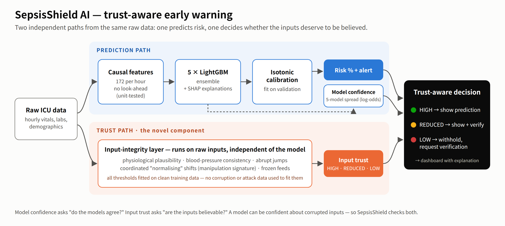

---

## Quick start (judge mode, ~2 minutes)

```bash
git clone <this repo> && cd sepsisshield
pip install -r requirements.txt          # exact pinned versions, Python 3.11
streamlit run app/app.py                 # dashboard with shipped models + 52 held-out test patients
python -m pytest -q tests                # 29 tests (1 needs raw data → skipped in judge mode)
```

Useful links inside the dashboard (the URL parameters set patient, fault and hour):

* `?pid=p119917&hour=58` — early warning, 9 h before onset, all inputs trusted
* `?pid=p119917&corr=Thermometer%20reports%20°F&start=34&len=8&hour=36` — false alert from a unit error → withheld
* `?pid=p018345&corr=Vitals%20overwritten%20to%20look%20normal&start=46&len=12&hour=48` — edited chart hides the alert → withheld

Full reproduction from raw data is [below](#reproduce-everything-from-raw-data).

| Early warning, all inputs trusted | Edited chart: models confident, inputs not → prediction withheld |
|---|---|
| 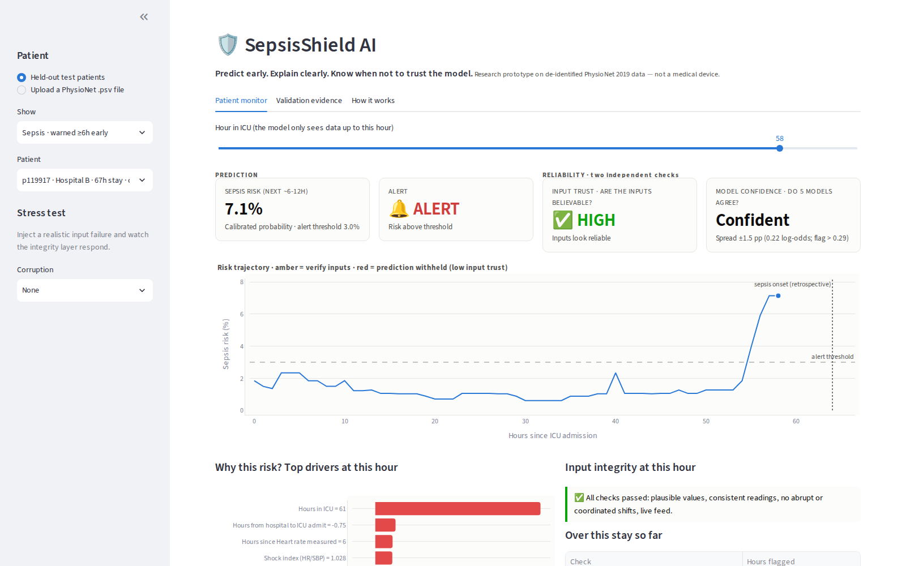 | 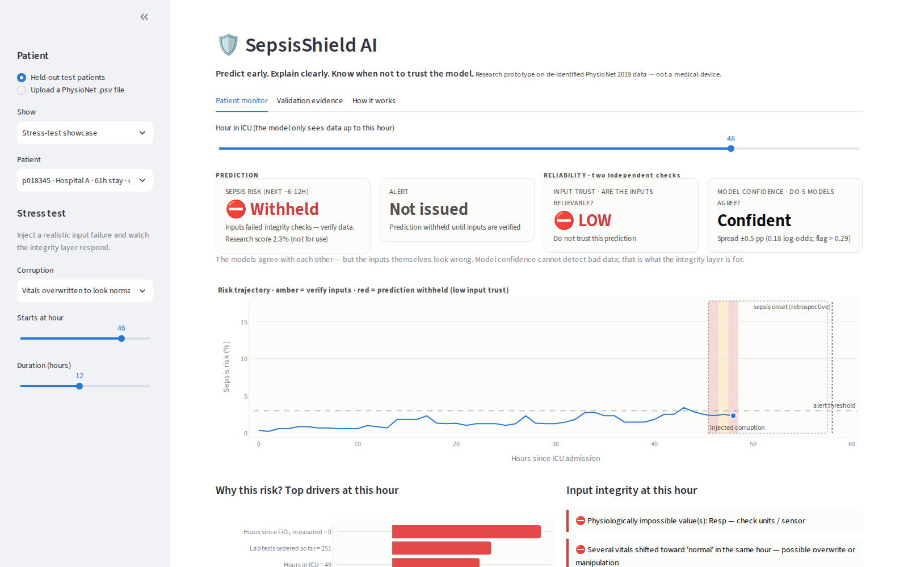 |

---

## Results

All numbers are for a **held-out test set of 8,068 patients (586 with sepsis)** that was never used for training,
tuning, calibration or threshold selection. The split is by patient and stratified by hospital and outcome. 95%
confidence intervals come from a patient-level bootstrap (500 resamples): patients are resampled with all their hours,
because hours from the same patient are correlated. Treating hours as independent would give an AUROC interval of about
0.848–0.857, roughly 2.7× too narrow.

### Prediction

| Metric | Value (95% CI) |
|---|---|
| Hour-level AUROC | **0.852** (0.840–0.865) |
| Hour-level AUPRC (prevalence 1.8%) | 0.122 (0.105–0.142) |
| Official PhysioNet 2019 utility | **0.425** (0.394–0.455) |
| Sepsis patients alerted (12 h before → 3 h after onset) | **79.4%** (75.9–82.5) |
| Sepsis patients alerted ≥ 6 h before onset | 53.9% (316 / 586) |
| Non-septic patients never alerted | 73.8% (72.8–74.9) |
| Calibration error (ECE) | 0.28 percentage points |

*Context, not a ranking:* the challenge's winning team reported a 5-fold cross-validation utility of 0.430 on the same
public data (and 0.360 on a hidden test set that included a third hospital). Evaluation protocols differ, so
the two numbers are not directly comparable.

### Baselines — same test set, same protocol

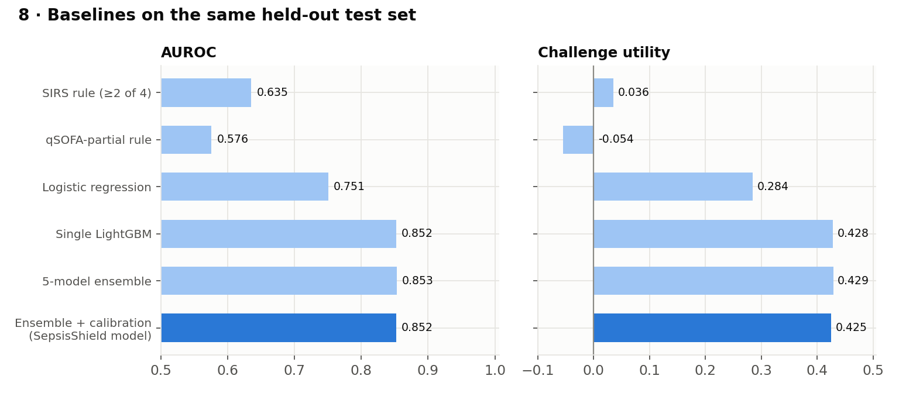

| Model | AUROC | AUPRC | Utility | Sepsis pts alerted | Non-septic never alerted |
|---|---|---|---|---|---|
| SIRS rule (≥ 2 of 4) | 0.635 | 0.029 | 0.036 | 82.1% | 26.5% |
| qSOFA-partial rule (≥ 1 of 2) | 0.576 | 0.022 | −0.054 | 86.9% | 9.7% |
| Logistic regression + isotonic | 0.751 | 0.072 | 0.284 | 76.8% | 57.4% |
| Single LightGBM | 0.852 | 0.131 | 0.428 | 83.1% | 70.2% |
| 5-model LightGBM ensemble | 0.853 | 0.130 | 0.429 | 80.9% | 72.7% |
| **Ensemble + isotonic calibration (SepsisShield model)** | **0.852** | 0.122 | 0.425 | 79.4% | 73.8% |

All rows use the same 8,068 test patients, the same metrics and validation-only threshold selection. The clinical rules
use their standard fixed cut-offs, with no tuning. Logistic regression uses median imputation and standardisation fitted
on training data, trained on a random 400,000-hour subsample of the training set for speed.

Gradient boosting is the step that matters for accuracy. The ensemble and calibration do **not** improve discrimination.
They exist for the trust design: calibrated probabilities that can be read at face value, and five models whose
disagreement is a measurable signal of model uncertainty. We report this plainly rather than claiming gains the data do
not show.

### Threshold sensitivity

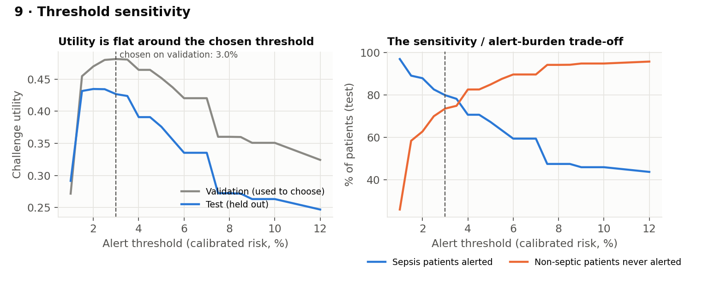

The alert threshold (3.0% calibrated risk) was chosen on validation data. Test utility is flat between 1.5% and 3.5%
(0.424–0.435); the best test threshold (2.0%) was *not* the one used. The threshold is a policy choice between
sensitivity and alert burden, and the dashboard shows it.

### External validation — an unseen hospital

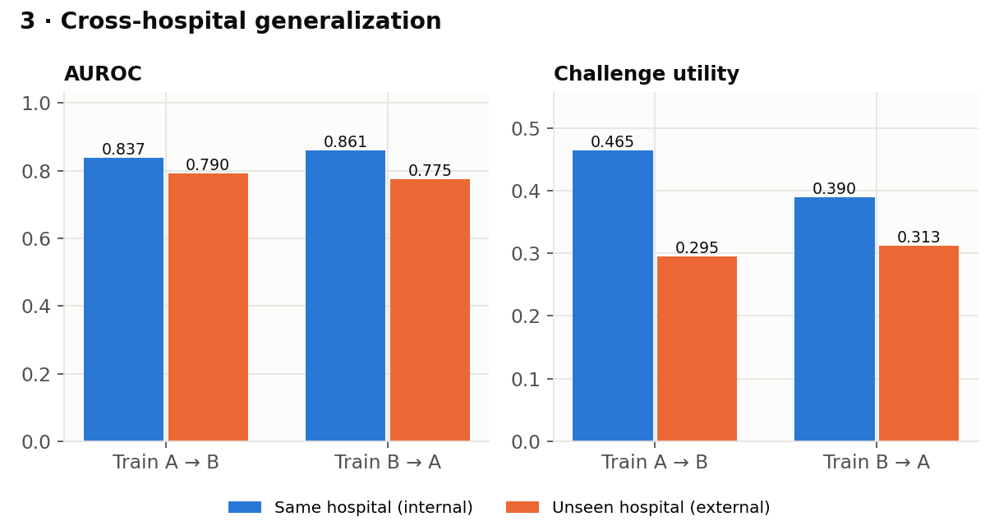

| Train → test | Internal AUROC | **External AUROC** | Internal utility | External utility | External sens. / spec. |
|---|---|---|---|---|---|
| Hospital A → B | 0.837 | **0.790** | 0.465 | 0.295 | 62% / 77% |
| Hospital B → A | 0.861 | **0.775** | 0.390 | 0.313 | 91% / 29% |

The table above is **zero-shot** external validation: no data from the destination hospital were used.

**Local recalibration (a separate retrospective experiment, not zero-shot, not deployment evidence).** Here we *do* use
destination-hospital **outcome labels**: the isotonic calibrator and alert threshold are refitted on a labelled 20% sample
of the destination hospital's patients (the model itself is unchanged), then evaluated on the remaining 80%:

| Transfer | ECE as-is → recalibrated | Utility as-is → recalibrated | Specificity as-is → recalibrated |
|---|---|---|---|
| A → B | 0.54 → **0.11** pp | 0.299 → 0.299 | 77% → 80% |
| B → A | 0.83 → **0.20** pp | 0.316 → 0.338 | 29% → 38% |

Recalibration repairs calibration but cannot restore discrimination (AUROC is unchanged, since recalibration is
monotone). Any new site would need local recalibration *and* validation.

### Subgroup audit

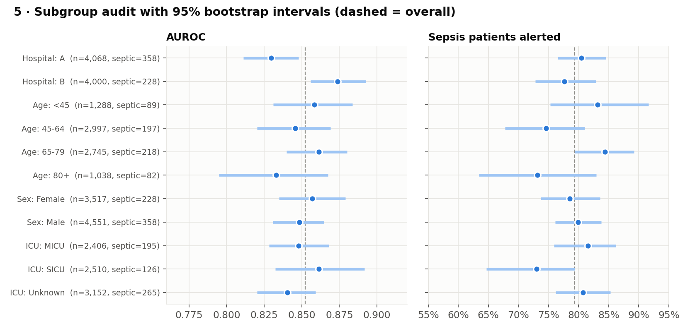

Every subgroup is shown with its patient count, number of sepsis cases and a bootstrap interval, so small-sample noise
is not mistaken for a fairness finding.

| Subgroup | Patients | Septic (prevalence) | AUROC (95% CI) | Sepsis patients alerted (95% CI) |
|---|---|---|---|---|
| Hospital A | 4,068 | 358 (8.8%) | 0.830 (0.811–0.848) | 80% (77–85) |
| Hospital B | 4,000 | 228 (5.7%) | 0.874 (0.856–0.893) | 78% (73–83) |
| Age < 45 | 1,288 | 89 (6.9%) | 0.858 (0.831–0.884) | 83% (75–92) |
| Age 45–64 | 2,997 | 197 (6.6%) | 0.846 (0.820–0.869) | 75% (68–81) |
| Age 65–79 | 2,745 | 218 (7.9%) | 0.861 (0.840–0.880) | 84% (79–89) |
| Age 80+ | 1,038 | 82 (7.9%) | 0.833 (0.795–0.867) | 73% (63–83) |
| Female | 3,517 | 228 (6.5%) | 0.857 (0.835–0.879) | 79% (74–84) |
| Male | 4,551 | 358 (7.9%) | 0.848 (0.831–0.865) | 80% (76–84) |
| Medical ICU | 2,406 | 195 (8.1%) | 0.848 (0.828–0.868) | 82% (76–86) |
| Surgical ICU | 2,510 | 126 (5.0%) | 0.861 (0.832–0.892) | 73% (65–79) |
| ICU unknown | 3,152 | 265 (8.4%) | 0.840 (0.820–0.859) | 81% (76–85) |

AUROC ranges from 0.830 to 0.874; within each attribute the intervals overlap, except Hospital A vs B. Sensitivity is
lower for patients aged 80+ (73%, CI 63–83%, 82 septic patients) and surgical-ICU patients (73%, CI 65–79%, 126 septic) than for ages 65–79 (84%, CI 79–89%). These are gaps to monitor, with wide intervals.

---

## The trust path — what is new

### Input-integrity layer (`src/integrity.py`)

It runs on raw inputs, independently of the model. **Every threshold is fitted on clean training patients; no corruption
or attack data is used to fit any threshold.** (The detector *design* was refined after inspecting test-cohort benchmark
results. The validation-cohort replication below checks that this did not inflate the results.)

| Check | Severity | Catches |
|---|---|---|
| Physiological plausibility | LOW | unit errors, sensor faults (Temp 98 "°C", Creatinine 88 "mg/dL") |
| BP consistency (DBP ≥ SBP, MAP > SBP) | LOW | impossible combinations |
| Coordinated normalising shift: summed, clipped z-score of HR/Resp/Temp falling and SBP/MAP rising vs the patient's own baseline; threshold at a 0.25% clean false-flag budget | LOW | overwritten or manipulated charts |
| Abrupt jump > 99.95th percentile of clean hourly changes | REDUCED | spikes (could be real deterioration, so never a veto) |
| Frozen feed (core vitals identical ≥ 8 h) | REDUCED | stalled interfaces, copied-forward values |
| Device discordance; calcium unit pattern | REDUCED | cuff vs arterial line; ionised Ca in the total-Ca field |
| Ensemble disagreement > 99th pct of validation (log-odds) | REDUCED | inputs unlike training data |
| Recent hard flag (≤ 6 h) | REDUCED | corrupted values still inside rolling features |

### Trust-aware abstention

| Input trust | System behaviour |
|---|---|
| HIGH | prediction shown normally |
| REDUCED | prediction shown with "verify inputs" |
| LOW | **prediction withheld: "requires data verification"** (research score kept for audit only) |

**Model confidence ≠ input trust.** The five models can agree perfectly about corrupted inputs, as in the screenshot
above. The dashboard shows the two signals side by side, and `tests/test_integrity_and_metrics.py` checks that input
trust is computed from the inputs alone.

### Does the shield do anything? Integrity ablation under six input failures

**Setup.** 3,086 held-out test patients (all 586 septic + 2,500 random non-septic). Each failure is injected into a
10-hour window of the **raw** data and the full pipeline is re-run. For septic patients the window is placed in the
decisive period, 12 h before to 3 h after onset (worst case); for non-septic patients it is placed at random.

**What counts.** An *alert-changing fault* is a patient-hour inside the corruption window where the fault **flipped the
alert decision and the new decision is wrong**:
* a **suppressed alert**: clean data → alert, corrupted data → no alert, inside a septic patient's useful window
  (12 h before to 3 h after onset); or
* a **spurious alert**: clean data → no alert, corrupted data → alert, *outside* any useful window (a non-septic patient,
  or a septic patient far from onset).

New alerts that a fault happens to create inside a septic patient's useful window are **not** counted, because the
decision they produce is not wrong (2,062 such hours for accidental faults, reported separately in
`results/abstention.json`). **Without the integrity layer, every alert-changing fault reaches the clinician as a
normal-looking prediction.** With it:

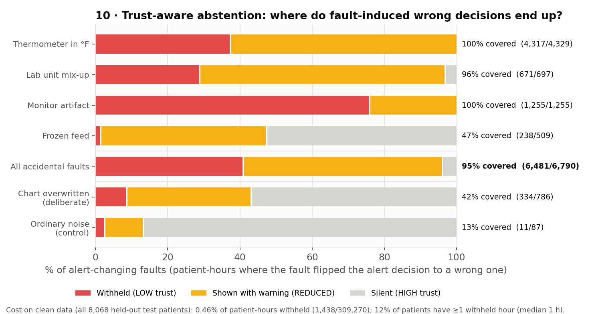

| Scenario | Alert-changing faults | Withheld | Flagged | Silent | **Flagged or withheld** |
|---|---|---|---|---|---|
| Thermometer reports °F | 4,329 | 1,609 | 2,708 | 12 | **99.7%** |
| Lab unit mix-up | 697 | 200 | 471 | 26 | **96.3%** |
| Monitor artifact | 1,255 | 951 | 304 | 0 | **100%** |
| Frozen feed | 509 | 6 | 232 | 271 | **46.8%** |
| **All accidental faults** | **6,790** | **2,766** | **3,715** | **309** | **95.4%** |
| **Deliberately edited inputs** | **786** | 66 | 268 | 452 | **42.5%** |
| Ordinary noise (control) | 87 | 2 | 9 | 76 | 12.6% |

**Read these numbers with their scope.** The 95.4% applies to the four *accidental* fault types we simulated. It does not
apply to deliberate edits (42.5%) or to failure types we did not simulate.

* **By direction (accidental faults):** spurious alerts 98.3% (6,210 / 6,317); suppressed alerts 57.3% (271 / 473), limited
  mainly by frozen feeds, which by definition can only be recognised after 8 identical hours.
* **Attributable coverage:** counting only flags that the fault itself caused (the same hour was HIGH trust on clean data),
  coverage is 89.4% for accidental faults and 34.5% for deliberate edits.
* **Validation-cohort replication:** the integrity layer's *thresholds* were always fitted on training patients, but its
  *design* (severity tiers, the coordinated-shift detector) was revised after inspecting benchmark results on the test
  cohort. To check that this did not inflate the results, the full benchmark was re-run on the 4,034 validation patients,
  which played no part in any integrity design decision: accidental faults **94.7%** (3,313 / 3,498), deliberate edits
  **48.0%** (212 / 442), clean predictions withheld 0.48%.
* **Patient level:** every septic patient whose alert an accidental fault suppressed received at least one trust warning
  (42 / 42), as did every non-septic patient given a new false alarm (773 / 773).

**Cost on clean data** (all 8,068 held-out test patients, no corruption):
* **0.46% of patient-hours withheld** (1,438 / 309,270) and 4.7% flagged.
* 12% of patients have at least one withheld hour, typically a single hour (median 1).
* Of the clean withholds, 48% are triggered by values that are genuinely impossible in the original records (withholding
  is correct there), and 52% by the coordinated-shift detector firing on real patients (likely false flags, e.g. rapid
  improvement after treatment).
* Of 4,846 correct sepsis-alert hours, 38 (0.8%) were withheld; 464 of the 465 detected sepsis patients still received at
  least one shown alert.

**Found in the real data:** 2,548 physiologically impossible hours in the *original* PhysioNet files (e.g. FiO₂ 4000,
respiratory rate 1) and 9,884 calcium values clustered at 1.18, consistent with ionised calcium (mmol/L) entered into a
total-calcium (mg/dL) field.

### Principal limitation: deliberate manipulation

Detection was substantially weaker for deliberately edited inputs: 42.5% of alert-changing edits were flagged or withheld
(334 / 786; 48.0% on the validation cohort). It sees a jump when the edit
begins; a careful, gradual falsification that stays inside normal physiology is not detectable from vitals alone.
Concrete next steps: (1) **cross-signal consistency**, predicting each vital from the others and from labs and flagging
residuals (an overwritten heart rate that no longer matches lactate, WBC and respiratory trends); (2) **provenance
signals** from the EHR audit trail (who changed a value, when, and whether it was device-captured or manually entered),
which is the strongest defence in practice; (3) **conformal risk bounds** so abstention thresholds carry a
distribution-free guarantee.

---

## How the prediction path works

* **Data:** [PhysioNet/CinC Challenge 2019](https://physionet.org/content/challenge-2019/1.0.0/): 40,336 ICU patients,
  1,552,210 patient-hours, 2,932 sepsis cases (Sepsis-3 based labels) from two US hospital systems.
  See [DATA_CARD.md](DATA_CARD.md).
* **Features (172, causal):** last observed value; hours since each variable was measured (informative missingness);
  6 h / 12 h rolling statistics and changes; lab trajectories; SIRS, qSOFA- and SOFA-style composites; shock index.
  `tests/test_no_leakage.py` recomputes features on every truncated history and perturbs future values to prove
  no look-ahead.
* **Model:** LightGBM × 5 seeds, hyper-parameters chosen on validation only (`src/tune.py`,
  `results/logs/log_tune.txt`); isotonic calibration and utility-optimal threshold fitted on validation patients
  (`tests/test_isolation.py` re-derives both from the shipped validation predictions). See [MODEL_CARD.md](MODEL_CARD.md).
* **Explanations:** exact TreeSHAP contributions (LightGBM `pred_contrib`), averaged over the ensemble.

<details><summary>Further validation figures: calibration, lead time, feature ablation, global drivers</summary>

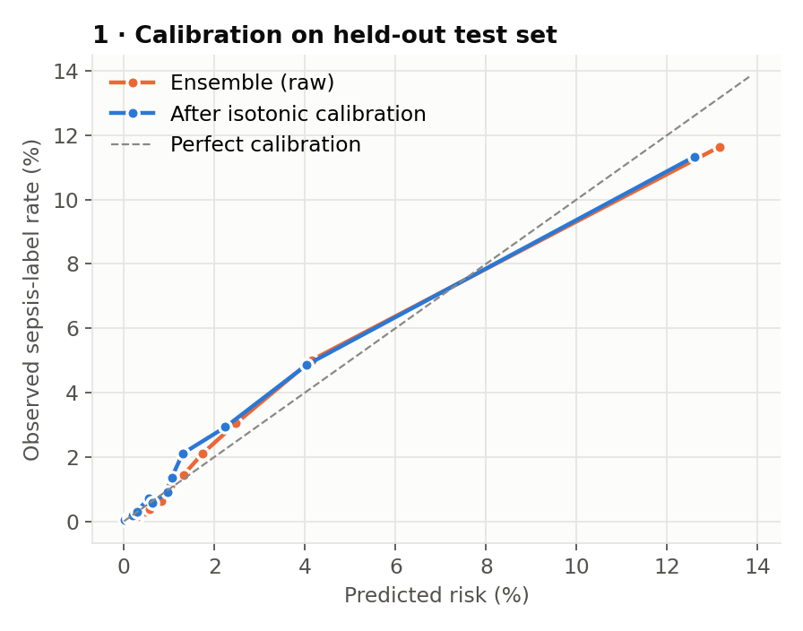 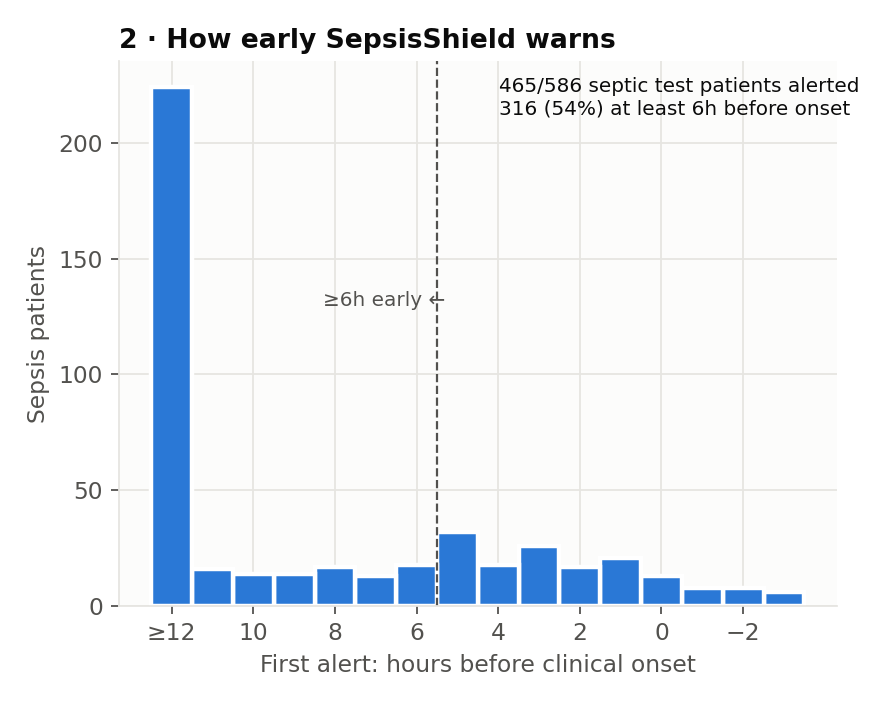
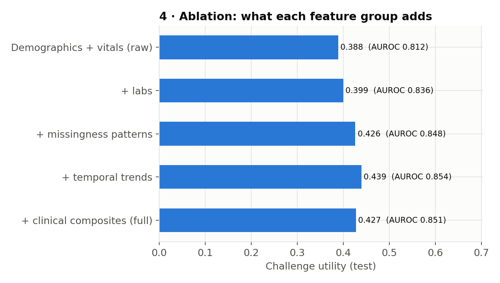 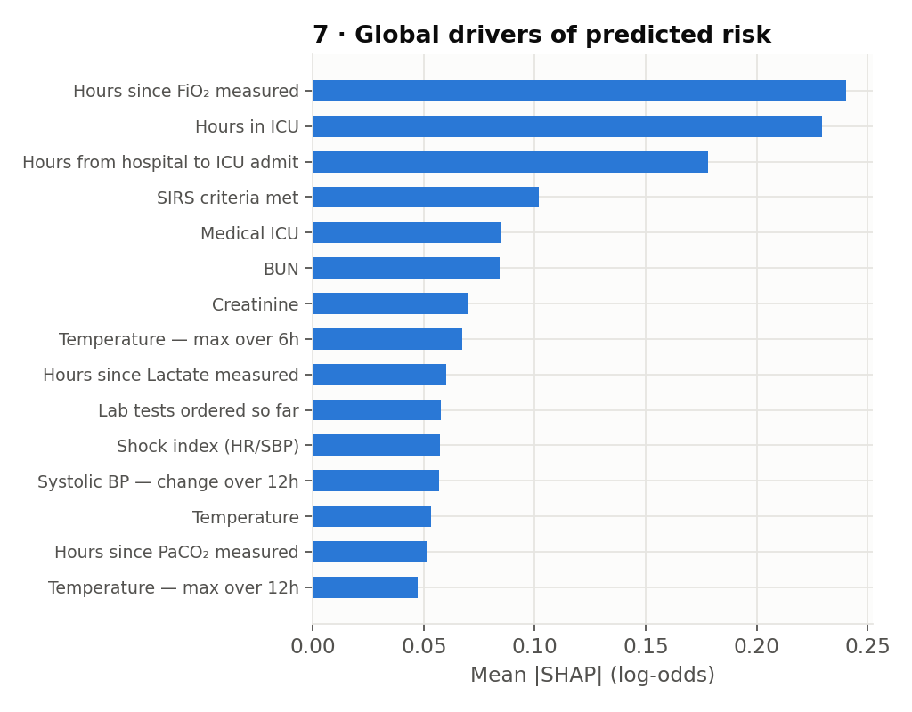

* The raw ensemble was already close to calibrated (ECE 0.32 pp); isotonic calibration gives 0.28 pp.
* Feature ablation (single model): labs, informative missingness and temporal trends each add signal (utility 0.388 →
  0.439); clinical composites did not (0.439 → 0.427), and they are kept for legible explanations.
* The strongest global drivers include care-process signals (time since FiO₂ / lactate were measured, number of labs
  ordered). These are predictive but hospital-specific, which is one reason for the cross-hospital drop.
</details>

---

## How SepsisShield relates to existing work

SepsisShield does not claim a better sepsis classifier. Its contribution is the **integration** of pieces that usually
live apart:

| Line of work | What it does | What SepsisShield adds |
|---|---|---|
| Sepsis prediction: PhysioNet 2019 entries [1, 11]; deployed systems such as TREWS [10] | estimate risk from EHR time series | the same task, plus an explicit decision about whether the inputs deserve trust |
| External validation of deployed models [6] and dataset shift [7] | show models degrade silently in new settings | cross-hospital validation, recalibration experiment, per-hour trust signal |
| EHR data-quality assessment [14] | offline audits of data plausibility and conformance | online, per-patient-hour checks wired into the prediction decision |
| Adversarial attacks on medical ML [8] | show small input changes can flip model outputs | a manipulation benchmark and a detector for coordinated normalising edits, with its failure rate reported |
| Uncertainty estimation (deep ensembles [9]) and selective prediction [15] | quantify model uncertainty and abstain when unsure | shows model confidence alone misses corrupted inputs; abstention is driven by input trust |

## Reproduce everything from raw data

```bash
pip install -r requirements.txt
wget -r -N -c -np -nH --cut-dirs=4 -P data/raw https://physionet.org/files/challenge-2019/1.0.0/training/
./run_all.sh            # ~55 min on 2 CPU cores; rebuilds every number, table and figure
python -m pytest -q tests
```

A from-scratch rerun reproduced `results/results.json` and `results/integrity_benchmark.json` byte for byte. Seeds, splits,
thresholds and calibrators are saved in `models/`.

```
app/            Streamlit dashboard (judge mode) + held-out demo patients
src/            data → features → training → integrity → experiments → figures
tests/          leakage, isolation, integrity, utility and pipeline tests (run in CI, plus a browser test of abstention)
models/         5 LightGBM models, calibrator, thresholds, integrity config
results/        results JSON, figures, screenshots, logs/
submission/     Devpost text, video, video script
tools/          screenshot, architecture and video tooling
```

## Limitations

* Retrospective data from two US hospital systems, with no prospective or real-time evaluation.
* Labels follow the challenge's Sepsis-3 based definition, shifted 6 h early; lead time is measured against that
  definition and capped at 12 h by the evaluation window.
* External AUROC drops to 0.78–0.79; thresholds and calibration must be re-fitted locally.
* The model leans on care-process signals that differ between hospitals.
* Integrity coverage is high for three of the four accidental fault types, 47% for frozen feeds, and 42.5% for deliberate edits.
* The integrity layer's design was informed by test-cohort benchmark results; a validation-cohort replication gives similar
  numbers, but a fully independent benchmark cohort would be cleaner.
* Corruptions in the benchmark are simulated; real-world failure frequencies are unknown.
* A research prototype, not a medical device, and not validated for any clinical decision.

## References

1. Reyna MA, Josef CS, Jeter R, et al. Early Prediction of Sepsis From Clinical Data: The PhysioNet/Computing in Cardiology Challenge 2019. *Critical Care Medicine* 48(2):210–217 (2020). Dataset: PhysioNet, CC BY 4.0.
2. Singer M, Deutschman CS, Seymour CW, et al. The Third International Consensus Definitions for Sepsis and Septic Shock (Sepsis-3). *JAMA* 315(8):801–810 (2016).
3. Ke G, Meng Q, Finley T, et al. LightGBM: A Highly Efficient Gradient Boosting Decision Tree. *NeurIPS* (2017).
4. Lundberg SM, Erion G, Chen H, et al. From local explanations to global understanding with explainable AI for trees. *Nature Machine Intelligence* 2:56–67 (2020).
5. Zadrozny B, Elkan C. Transforming classifier scores into accurate multiclass probability estimates. *KDD* (2002).
6. Wong A, Otles E, Donnelly JP, et al. External Validation of a Widely Implemented Proprietary Sepsis Prediction Model in Hospitalized Patients. *JAMA Internal Medicine* 181(8):1065–1070 (2021).
7. Finlayson SG, Subbaswamy A, Singh K, et al. The Clinician and Dataset Shift in Artificial Intelligence. *NEJM* 385:283–286 (2021).
8. Finlayson SG, Bowers JD, Ito J, Zittrain JL, Beam AL, Kohane IS. Adversarial attacks on medical machine learning. *Science* 363(6433):1287–1289 (2019).
9. Lakshminarayanan B, Pritzel A, Blundell C. Simple and Scalable Predictive Uncertainty Estimation using Deep Ensembles. *NeurIPS* (2017).
10. Adams R, Henry KE, Sridharan A, et al. Prospective, multi-site study of patient outcomes after implementation of the TREWS machine learning-based early warning system for sepsis. *Nature Medicine* 28:1455–1460 (2022). doi:10.1038/s41591-022-01894-0
11. Morrill J, Kormilitzin A, Nevado-Holgado A, et al. The Signature-Based Model for Early Detection of Sepsis from Electronic Health Records in the Intensive Care Unit. *Computing in Cardiology* (2019).
12. Bone RC, Balk RA, Cerra FB, et al. Definitions for sepsis and organ failure and guidelines for the use of innovative therapies in sepsis. *Chest* 101(6):1644–1655 (1992).
13. Seymour CW, Liu VX, Iwashyna TJ, et al. Assessment of Clinical Criteria for Sepsis (qSOFA). *JAMA* 315(8):762–774 (2016).
14. Kahn MG, Callahan TJ, Barnard J, et al. A Harmonized Data Quality Assessment Terminology and Framework for the Secondary Use of Electronic Health Record Data. *eGEMs* 4(1):1244 (2016). doi:10.13063/2327-9214.1244
15. Geifman Y, El-Yaniv R. Selective Classification for Deep Neural Networks. *NeurIPS* (2017).

## Licence

Code: MIT. Data: PhysioNet/CinC Challenge 2019, Creative Commons Attribution 4.0. The data are not redistributed here
except for 52 de-identified held-out demo patients used by the dashboard.
